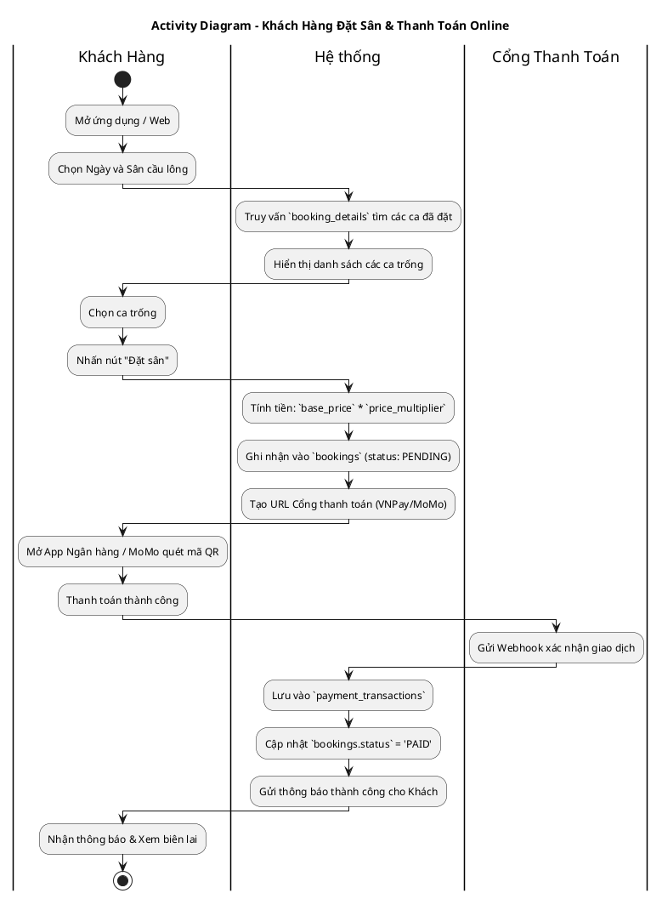
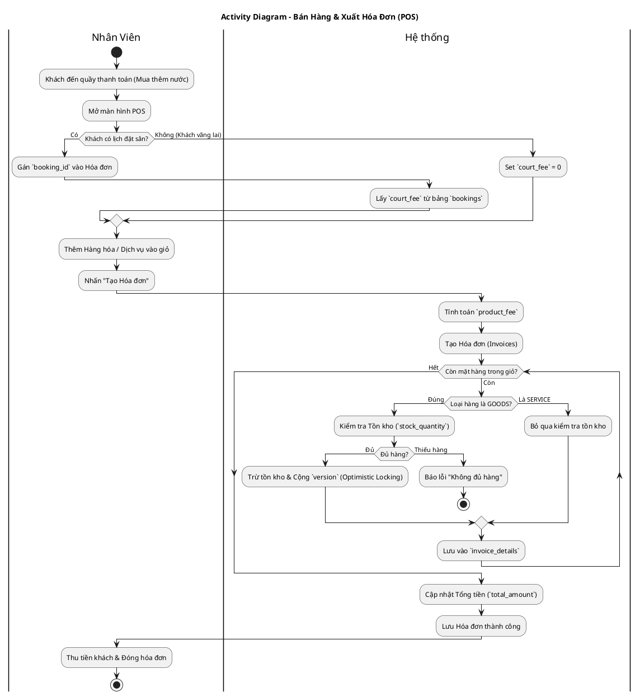
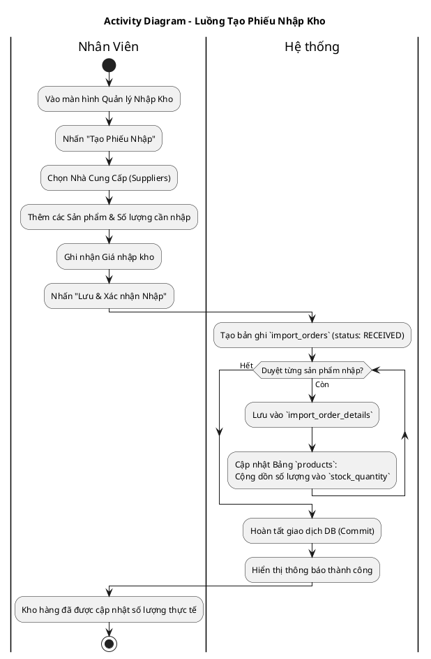

# Sơ đồ Activity (Hoạt động) - Hệ thống Quản lý Sân Cầu Lông (Bản Cập Nhật V4)

Các sơ đồ Hoạt động mô phỏng lại luồng đi của người dùng và hệ thống, bao gồm các điều kiện logic (if/else), phù hợp với Database V4 (Thanh toán online 100%, Hệ số giờ, Nhập kho).

## Hướng dẫn xem hình
Copy từng đoạn code bên dưới và dán vào **[PlantText](https://www.planttext.com/)**.

---

## 1. Luồng Tìm kiếm & Đặt Sân (Khách Hàng)

---

## 2. Luồng Bán hàng POS (Nhân Viên)

---

## 3. Luồng Nhập Hàng Vào Kho (Nhân Viên / Quản Lý)

