# Tổng quan Cơ sở dữ liệu - Hệ thống Quản lý Sân Cầu Lông

Tài liệu này cung cấp cái nhìn tổng quan toàn diện về cấu trúc cơ sở dữ liệu của hệ thống, bao gồm sơ đồ thực thể liên kết (ERD) và giải thích chi tiết chức năng, nghiệp vụ của từng phân hệ. CSDL được thiết kế theo các tiêu chuẩn chặt chẽ nhằm đảm bảo tính toàn vẹn dữ liệu, khả năng mở rộng và xử lý các bài toán thực tế như chống trùng lịch hay chống âm kho.

## 1. Sơ đồ Thực thể Liên kết (ERD)

Bạn có thể copy đoạn code bên dưới và dán vào [PlantText](https://www.planttext.com/) hoặc [Mermaid Live Editor](https://mermaid.live/) để xem ảnh trực quan.

```mermaid
erDiagram
    %% Auth
    users {
        uuid id PK
        string email
        string password
        datetime created_at
        datetime updated_at
        datetime deleted_at
    }
    roles {
        uuid id PK
        string role_name
        datetime created_at
    }
    user_roles {
        uuid user_id PK, FK
        uuid role_id PK, FK
        datetime created_at
    }

    %% Domain Users
    customers {
        uuid id PK
        uuid user_id FK "1-1 với users"
        string full_name
        string phone
        string address "Địa chỉ khách hàng"
        datetime created_at
        datetime updated_at
    }
    staffs {
        uuid id PK
        uuid user_id FK "1-1 với users"
        string full_name
        string phone
        string position "Vị trí (Thu ngân, Quản lý)"
        datetime created_at
        datetime updated_at
    }
    
    %% Core Booking
    courts {
        uuid id PK
        int court_number "Số thứ tự sân (1-10), Unique"
        string name
        string type
        string status "AVAILABLE/MAINTENANCE/CLOSED"
        numeric base_price
        datetime created_at
        datetime updated_at
        datetime deleted_at
    }
    time_slots {
        uuid id PK
        time start_time
        time end_time "CHECK: start_time < end_time"
        numeric price_multiplier "Hệ số (1.0, 1.5)"
        datetime created_at
        datetime updated_at
    }
    bookings {
        uuid id PK
        uuid customer_id FK "Trỏ về Khách hàng"
        string status "PENDING/PAID/CHECKED_IN/COMPLETED/NO_SHOW"
        numeric court_fee "Tiền sân (Giá chốt từ booking_details)"
        timestamp expires_at "Thời gian hết hạn slot (PENDING timeout)"
        uuid created_by FK "Nhân viên tạo (nullable nếu khách tự đặt)"
        uuid updated_by FK "Nhân viên cập nhật cuối"
        datetime created_at
        datetime updated_at
    }
    booking_details {
        uuid id PK
        uuid booking_id FK
        uuid court_id FK
        uuid time_slot_id FK
        date booking_date 
        numeric price "Giá chốt = base_price * price_multiplier"
        datetime created_at
    }
    
    %% POS
    categories {
        uuid id PK
        string category_name
        datetime created_at
        datetime updated_at
        datetime deleted_at
    }
    products {
        uuid id PK
        uuid category_id FK
        string name
        string type "GOODS/SERVICE"
        numeric price "Giá bán lẻ"
        int stock_quantity "0 nếu type = SERVICE"
        int version "Optimistic locking cho GOODS"
        uuid created_by FK "Nhân viên tạo"
        uuid updated_by FK "Nhân viên cập nhật cuối"
        datetime created_at
        datetime updated_at
        datetime deleted_at
    }
    
    promotions {
        uuid id PK
        string code "Mã khuyến mãi UNIQUE (VD: SUMMER2024)"
        string name "Tên chương trình"
        date valid_from "Ngày bắt đầu"
        date valid_to "Ngày kết thúc"
        boolean is_active "true/false"
        uuid created_by FK "Nhân viên tạo"
        datetime created_at
        datetime updated_at
        datetime deleted_at
    }
    
    discount_rules {
        uuid id PK
        uuid promotion_id FK "Trỏ về promotions"
        string rule_type "PRODUCT/INVOICE_TOTAL/VOUCHER"
        uuid target_product_id FK "Nullable, cho PRODUCT type"
        numeric min_invoice_amount "Cho INVOICE_TOTAL type"
        string voucher_code "Nullable, cho VOUCHER type"
        int max_usage_per_customer "Giới hạn số lần dùng (VOUCHER)"
        string discount_type "PERCENT/AMOUNT"
        numeric discount_value "10 (%) hoặc 50000 (VND)"
        datetime created_at
    }
    
    customer_voucher_usage {
        uuid id PK
        uuid customer_id FK "Khách hàng"
        uuid discount_rule_id FK "Rule đã dùng"
        uuid invoice_id FK "Hoá đơn áp dụng"
        datetime used_at "Thời gian sử dụng"
    }
    
    invoices {
        uuid id PK
        uuid booking_id FK "Nullable"
        uuid customer_id FK "Người mua"
        uuid promotion_id FK "Nullable, mã KM áp dụng"
        string payment_method "VNPAY"
        string status "DRAFT/PAID/REFUNDED/CANCELLED"
        numeric court_fee "Tiền sân, Nullable nếu không có booking"
        numeric product_fee "Tiền Hàng hóa"
        numeric discount_amount "Số tiền giảm từ promotion"
        numeric total_amount "court_fee + product_fee - discount_amount"
        uuid created_by FK "Nhân viên tạo hoá đơn"
        uuid updated_by FK "Nhân viên cập nhật cuối"
        datetime created_at
        datetime updated_at
    }
    payment_transactions {
        uuid id PK
        uuid booking_id FK "Nullable, nếu thanh toán tiền sân"
        uuid invoice_id FK "Nullable, nếu thanh toán hoá đơn"
        string payment_method "VNPAY"
        string transaction_id "Nullable. Mã GD từ cổng thanh toán"
        string status "PENDING/SUCCESS/FAILED/REFUNDED"
        numeric amount
        datetime transaction_date "Thời gian giao dịch thành công"
        datetime created_at
        string note
    }
    invoice_details {
        uuid id PK
        uuid invoice_id FK
        uuid product_id FK
        int quantity 
        numeric unit_price 
        string note
        datetime created_at
    }

    %% Inventory
    suppliers {
        uuid id PK
        string name
        string phone
        string address
        datetime created_at
        datetime updated_at
        datetime deleted_at
    }
    import_orders {
        uuid id PK
        uuid supplier_id FK
        string status "DRAFT/CONFIRMED/RECEIVED/CANCELLED"
        numeric total_amount
        datetime import_date
        uuid created_by FK "Nhân viên tạo"
        uuid updated_by FK "Nhân viên cập nhật cuối"
        datetime created_at
        datetime updated_at
    }
    import_order_details {
        uuid id PK
        uuid import_order_id FK
        uuid product_id FK
        int quantity
        numeric import_price "Giá nhập kho"
        datetime created_at
    }

    %% Relationships
    users ||--o| customers : "is a"
    users ||--o| staffs : "is a"
    users ||--o{ user_roles : "has"
    roles ||--o{ user_roles : "assigned to"
    
    customers ||--o{ bookings : "makes"
    staffs ||--o{ bookings : "creates (nullable)"
    staffs ||--o{ invoices : "creates"
    customers ||--o| invoices : "buys"
    
    bookings ||--|{ booking_details : "contains"
    courts ||--o{ booking_details : "booked in"
    time_slots ||--o{ booking_details : "booked for"
    
    bookings ||--o| invoices : "generates"
    bookings ||--o{ payment_transactions : "paid via"
    invoices ||--o{ payment_transactions : "paid via"
    
    categories ||--o{ products : "contains"
    staffs ||--o{ products : "creates"
    staffs ||--o{ promotions : "creates"
    promotions ||--o{ discount_rules : "has"
    discount_rules ||--o{ customer_voucher_usage : "tracked in"
    products ||--o{ discount_rules : "targeted by (PRODUCT type)"
    customers ||--o{ customer_voucher_usage : "uses"
    promotions ||--o{ invoices : "applied to"
    invoices ||--o{ customer_voucher_usage : "records usage"
    products ||--o{ invoice_details : "sold in"
    invoices ||--|{ invoice_details : "includes"
    
    suppliers ||--o{ import_orders : "supplies"
    staffs ||--o{ import_orders : "creates"
    import_orders ||--|{ import_order_details : "contains"
    products ||--o{ import_order_details : "imported in"
```



## 2. Tiêu chuẩn và Kiến trúc Chung
*   **Khóa chính (Primary Key):** Toàn bộ các bảng sử dụng kiểu dữ liệu `UUID` để bảo mật ID, chống lại các cuộc tấn công dò quét dữ liệu (ID Guessing).
*   **Kiểu Dữ liệu Tiền tệ:** Tiền tệ (price, amount) bắt buộc sử dụng kiểu `NUMERIC` để lưu trữ số chính xác tuyệt đối, tránh lỗi sai số làm tròn của kiểu `Float/Double` trong kế toán.
*   **Xóa Mềm (Soft Delete):** Áp dụng cột `deleted_at` ở các thực thể quan trọng (`users`, `courts`, `products`) để không bao giờ mất hẳn dữ liệu báo cáo trong quá khứ khi thực hiện lệnh xóa trên UI.
*   **Audit Trail (Truy vết):** Các bảng quan trọng (`bookings`, `invoices`, `products`, `import_orders`) có các cột `created_by`, `created_at`, `updated_at` để truy vết ai tạo/sửa bản ghi và khi nào, phục vụ kiểm toán nội bộ và giải quyết tranh chấp.
*   **Status Enum Values:** Tất cả các cột `status` đều được định nghĩa rõ ràng giá trị cho phép:
    *   `bookings.status`: PENDING, PAID, CHECKED_IN, COMPLETED, NO_SHOW
    *   `invoices.status`: DRAFT, PAID, REFUNDED, CANCELLED
    *   `courts.status`: AVAILABLE, MAINTENANCE, CLOSED
    *   `products.type`: GOODS, SERVICE
    *   `import_orders.status`: DRAFT, CONFIRMED, RECEIVED, CANCELLED
    *   `payment_transactions.status`: PENDING, SUCCESS, FAILED, REFUNDED
*   **Ràng buộc Payment Transactions:** Một giao dịch thanh toán chỉ có thể liên kết với **HOẶC** booking **HOẶC** invoice, không thể cả hai. Constraint: `CHECK ((booking_id IS NOT NULL)::int + (invoice_id IS NOT NULL)::int = 1)`

## 3. Giải thích Chi tiết các Phân hệ (Modules)

### 3.1. Phân hệ Định danh & Tài khoản (Auth & Users)
*   **Các bảng:** `users`, `roles`, `user_roles`, `customers`, `staffs`
*   **Mô tả:** Hệ thống phân tách rõ rệt giữa dữ liệu xác thực (Auth) và dữ liệu nghiệp vụ (Domain):
    *   Bảng `users` chỉ chứa `email` và `password` dùng cho khâu Đăng nhập.
    *   Bảng `customers` và `staffs` nối 1-1 với `users` để chứa các thông tin đặc thù nghiệp vụ (Khách hàng có số điện thoại liên hệ, Nhân viên có chức vụ).
    *   Bảng `user_roles` giải quyết bài toán quan hệ Nhiều-Nhiều (N-N), cho phép một tài khoản đóng nhiều vai trò (Ví dụ: Vừa là Admin quản trị, vừa là Thu ngân tính tiền).

### 3.2. Phân hệ Thiết lập Lõi (Core Data)
*   **Các bảng:** `courts`, `time_slots`
*   **Mô tả:** Dùng để khởi tạo tài nguyên cho hệ thống hoạt động.
    *   `courts`: Lưu trữ thông tin sân và `base_price` (Giá gốc ban đầu). Cột `court_number` (kiểu INT với ràng buộc UNIQUE) đánh số thứ tự sân từ 1 đến N (ví dụ: 1-10), giúp nhân viên và khách hàng dễ dàng nhận diện sân khi đặt hoặc check-in. Database đảm bảo không có 2 sân trùng số thông qua Unique Constraint.
    *   `time_slots`: **Bảng master data tĩnh** chứa các khung giờ template (06:00-07:00, 07:00-08:00, ..., 21:00-22:00). **Không có cột `status`** vì đây chỉ là template - trạng thái "đã đặt" hay "còn trống" được suy ra từ việc có hay không có record tương ứng trong bảng `booking_details`. Cột `price_multiplier` (Hệ số nhân) giúp chủ sân linh hoạt cài đặt giá Giờ Cao Điểm (ví dụ nhân 1.5 lần giá gốc vào khung 17h-22h).

### 3.3. Phân hệ Đặt sân & Thanh toán Online (Booking Engine)
*   **Các bảng:** `bookings`, `booking_details`, `payment_transactions`
*   **Mô tả:** Quản lý quy trình giữ chỗ và thu tiền sân trước của khách hàng.
    *   **Thanh toán 100% Online:** Khách hàng buộc phải thanh toán tiền sân ngay trên App. Do đó, bảng `bookings` lưu trữ `court_fee` để cung cấp ngay lập tức dữ liệu cho các cổng thanh toán (VNPay Sandbox) xuất mã QR. Cột này còn dùng để thống kê thiệt hại từ các giao dịch bùng kèo (không bao giờ check-in).
    *   **Trạng thái Booking:** Vòng đời của một booking từ PENDING (chờ thanh toán) → PAID (đã thanh toán online) → CHECKED_IN (đã đến sân, invoice được tạo tự động) → COMPLETED (đã chơi xong) hoặc NO_SHOW (bùng kèo). **Không có trạng thái CANCELLED** - Khách hàng không được phép hủy booking sau khi đã thanh toán, đảm bảo doanh thu ổn định cho chủ sân.
    *   **Timeout Mechanism (Giữ slot tạm thời):** Cột `bookings.expires_at` lưu thời điểm hết hạn (thường là `created_at + 15 phút`). Một **Scheduler (Spring @Scheduled)** chạy mỗi 1 phút sẽ tự động chuyển các booking có `status = 'PENDING'` và `expires_at < NOW()` sang trạng thái `EXPIRED`, giải phóng slot cho khách khác đặt. Logic:
        ```java
        @Scheduled(fixedRate = 60000) // Chạy mỗi 60 giây
        public void releaseExpiredBookings() {
            bookingRepo.updateExpiredBookings(); 
            // UPDATE bookings SET status = 'EXPIRED' 
            // WHERE status = 'PENDING' AND expires_at < NOW()
        }
        ```
    *   **Snapshot Price:** Khi đặt, giá cuối cùng sẽ được tính và ghi chết vào cột `price` trong `booking_details`. Dù sau này chủ sân đổi `base_price`, hóa đơn cũ vẫn giữ nguyên lịch sử.
    *   **Khóa đụng độ (Anti-Double Booking):** Hệ thống cài đặt **Unique Constraint** trên DB ở 3 cột `(booking_date, court_id, time_slot_id)` trong bảng `booking_details`. Hai người cùng lúc bấm nút đặt 1 sân sẽ có 1 người bị DB từ chối ngay lập tức (Duplicate Key Error), khắc phục triệt để lỗi Overbooking. Kết hợp với **Pessimistic Lock** (`@Lock(LockModeType.PESSIMISTIC_WRITE)`) khi query slot để giữ chỗ tạm thời.
    *   **Payment Transactions:** Bảng `payment_transactions` lưu trữ chi tiết giao dịch từ cổng thanh toán (VNPay Sandbox), bao gồm mã giao dịch (`transaction_id`), trạng thái (PENDING/SUCCESS/FAILED/REFUNDED), và thời gian thực tế. Một booking hoặc invoice có thể có nhiều payment transaction (ví dụ: thanh toán lần đầu thất bại, thanh toán lại lần 2).
        *   **transaction_id nullable:** VNPay attempts chưa được xác nhận chưa có mã giao dịch provider.
        *   **transaction_id UNIQUE (partial):** Đảm bảo không duplicate transaction từ VNPay Sandbox webhook retry (`CREATE UNIQUE INDEX ... WHERE transaction_id IS NOT NULL`).
        *   **Ràng buộc XOR:** Mỗi transaction chỉ được liên kết với HOẶC booking HOẶC invoice (không cả hai), đảm bảo bởi CHECK constraint: `CHECK ((booking_id IS NOT NULL)::int + (invoice_id IS NOT NULL)::int = 1)`.

### 3.4. Phân hệ Bán hàng & Dịch vụ (POS)
*   **Các bảng:** `categories`, `products`, `promotions`, `discount_rules`, `customer_voucher_usage`, `invoices`, `invoice_details`
*   **Mô tả:** Xử lý bán hàng tại quầy (Nước, Cầu, Đan lưới) và tổng hợp hóa đơn.
    *   **Thời điểm tạo Invoice:** Invoice được tạo tự động khi khách **CHECKED_IN** (đối với booking) hoặc khi khách vãng lai bắt đầu mua hàng. Invoice bắt đầu ở trạng thái DRAFT, cho phép thu ngân thêm sản phẩm, áp dụng khuyến mãi trước khi chuyển sang PAID.
    *   **Tách bạch Tiền bạc:** Hóa đơn `invoices` chia rõ `court_fee` (Khách đã trả online từ Booking), `product_fee` (Khách trả thêm tiền mua nước tại quầy), và `discount_amount` (Giảm giá từ khuyến mãi). Thu ngân chốt sổ cuối ngày sẽ cực kỳ minh bạch. Công thức: `total_amount = court_fee + product_fee - discount_amount`.
    *   **Hệ thống Khuyến mãi 3 Tầng (Enterprise-grade):**
        *   **Bảng `promotions`:** Master table chứa thông tin chung (code, name, validity dates, is_active). Một promotion có thể có nhiều discount rules.
        *   **Bảng `discount_rules`:** Chi tiết các quy tắc giảm giá, hỗ trợ 3 loại:
            1. **PRODUCT:** Giảm giá cho sản phẩm cụ thể (VD: Giảm 15% cho Nước Suối)
            2. **INVOICE_TOTAL:** Giảm giá theo tổng hóa đơn (VD: Hóa đơn >= 500k giảm 50k)
            3. **VOUCHER:** Mã voucher giới hạn số lần dùng (VD: Khách VIP giảm 20%, mỗi người dùng tối đa 1 lần)
        *   **Bảng `customer_voucher_usage`:** Tracking khách hàng đã dùng voucher nào, bao nhiêu lần, đảm bảo không vượt quá `max_usage_per_customer`. Unique constraint `(customer_id, discount_rule_id, invoice_id)` ngăn việc dùng 1 voucher nhiều lần cho cùng 1 invoice.
    *   **Logic áp dụng Khuyến mãi (Orchestration):**
        1. Validate promotion (is_active, valid_from/to, không bị soft delete)
        2. Lấy tất cả discount_rules của promotion
        3. Duyệt từng rule:
            - **PRODUCT:** Tính giảm giá cho từng sản phẩm matching trong invoice_details (discount × quantity)
            - **INVOICE_TOTAL:** Kiểm tra subtotal >= min_invoice_amount, áp dụng giảm (percent hoặc fixed amount)
            - **VOUCHER:** Kiểm tra khách chưa dùng hết max_usage_per_customer, áp dụng giảm + insert tracking vào customer_voucher_usage
        4. Tổng hợp discount_amount, cập nhật invoice.promotion_id và invoice.discount_amount
    *   **Constraints Quan Trọng:**
        - `CHECK (discount_amount <= court_fee + product_fee)`: Discount không được vượt quá subtotal
        - `CHECK (rule_type = 'PRODUCT' → target_product_id IS NOT NULL)`: PRODUCT rule phải có target
        - `CHECK (rule_type = 'VOUCHER' → voucher_code IS NOT NULL)`: VOUCHER rule phải có mã
    *   **Trạng thái Invoice:** DRAFT (đang soạn thảo), PAID (đã thanh toán), REFUNDED (đã hoàn tiền), CANCELLED (hủy hóa đơn).
    *   **Chống Âm Kho (Optimistic Locking):** Bảng `products` có cột `version`. Khi 2 thu ngân cùng click bán 1 món hàng cuối cùng, cơ chế Optimistic Locking trên Database sẽ từ chối luồng chạy chậm hơn, đảm bảo kho không bao giờ bị số âm. Hàng hóa (GOODS) sẽ bị kiểm tra tồn kho, trong khi Dịch vụ (SERVICE) thì không.
    *   **Audit Trail:** Các cột `created_by`, `updated_at` giúp truy vết ai tạo/sửa sản phẩm, khuyến mãi, hóa đơn, phục vụ kiểm toán nội bộ.

### 3.5. Phân hệ Quản lý Nhập kho (Inventory Receiving)
*   **Các bảng:** `suppliers`, `import_orders`, `import_order_details`
*   **Mô tả:** Tạo vòng tuần hoàn khép kín cho quản lý hàng hóa.
    *   Hàng hóa không tự sinh ra mà phải thông qua quy trình nhập hàng.
    *   **Trạng thái Import Order:** DRAFT (đang soạn phiếu nhập), CONFIRMED (đã xác nhận với nhà cung cấp), RECEIVED (đã nhận hàng vào kho và cộng vào `stock_quantity`), CANCELLED (hủy đơn nhập).
    *   Khi nhân viên tạo phiếu nhập `import_orders` từ nhà cung cấp `suppliers`, chỉ khi chuyển trạng thái sang RECEIVED thì số lượng hàng hóa mới được cộng dồn an toàn vào cột `stock_quantity` của bảng `products`.
    *   **Audit Trail:** Các cột `created_by`, `created_at`, `updated_at` giúp truy vết ai tạo/sửa phiếu nhập, phục vụ kiểm toán nội bộ.

---

## 6. Indexes Cần Thiết Cho Performance

Danh sách các indexes quan trọng cần tạo để tối ưu hóa performance:

### 6.1. Booking & Court Management
```sql
-- Tìm bookings của khách hàng
CREATE INDEX idx_bookings_customer_created 
ON bookings(customer_id, created_at DESC);

-- Tìm booking_details theo ngày và sân
CREATE INDEX idx_booking_details_date_court 
ON booking_details(booking_date, court_id);

-- Tìm bookings theo trạng thái
CREATE INDEX idx_bookings_status 
ON bookings(status) WHERE status IN ('PENDING', 'PAID', 'CHECKED_IN');

-- Tìm bookings hết hạn (cho scheduler)
CREATE INDEX idx_bookings_expires 
ON bookings(expires_at) 
WHERE status = 'PENDING' AND expires_at IS NOT NULL;

-- Unique constraint chống trùng lịch
CREATE UNIQUE INDEX uq_booking_slot 
ON booking_details(booking_date, court_id, time_slot_id);
```

### 6.2. Invoice & Payment
```sql
-- Tìm invoices của khách hàng
CREATE INDEX idx_invoices_customer_created 
ON invoices(customer_id, created_at DESC);

-- Tìm invoices liên quan đến booking
CREATE INDEX idx_invoices_booking 
ON invoices(booking_id) WHERE booking_id IS NOT NULL;

-- Tìm payment transactions theo booking
CREATE INDEX idx_payments_booking 
ON payment_transactions(booking_id) WHERE booking_id IS NOT NULL;

-- Tìm payment transactions theo invoice
CREATE INDEX idx_payments_invoice 
ON payment_transactions(invoice_id) WHERE invoice_id IS NOT NULL;

-- Unique constraint cho transaction_id (partial - chỉ non-null)
CREATE UNIQUE INDEX uq_transaction_id 
ON payment_transactions(transaction_id) 
WHERE transaction_id IS NOT NULL;

-- Tìm payment transactions theo status
CREATE INDEX idx_payments_status 
ON payment_transactions(status, transaction_date DESC);
```

### 6.3. Product & Inventory Management
```sql
-- Tìm products active theo category
CREATE INDEX idx_products_category_active 
ON products(category_id) WHERE deleted_at IS NULL;

-- Tìm products theo type và stock
CREATE INDEX idx_products_type_stock 
ON products(type, stock_quantity) WHERE type = 'GOODS';

-- Tìm invoice_details theo product
CREATE INDEX idx_invoice_details_product 
ON invoice_details(product_id);

-- Tìm import orders theo supplier
CREATE INDEX idx_import_orders_supplier 
ON import_orders(supplier_id, import_date DESC);
```

### 6.4. Promotion System
```sql
-- Tìm promotions active
CREATE INDEX idx_promotions_code_active 
ON promotions(code) WHERE is_active = true AND deleted_at IS NULL;

-- Tìm promotions theo validity dates
CREATE INDEX idx_promotions_validity 
ON promotions(valid_from, valid_to) 
WHERE is_active = true AND deleted_at IS NULL;

-- Tìm discount_rules theo promotion
CREATE INDEX idx_discount_rules_promotion 
ON discount_rules(promotion_id);

-- Tìm discount_rules theo product (PRODUCT type)
CREATE INDEX idx_discount_rules_product 
ON discount_rules(target_product_id) 
WHERE rule_type = 'PRODUCT';

-- Tìm discount_rules theo voucher code
CREATE INDEX idx_discount_rules_voucher 
ON discount_rules(voucher_code) 
WHERE rule_type = 'VOUCHER' AND voucher_code IS NOT NULL;

-- Tìm voucher usage của khách hàng
CREATE INDEX idx_voucher_usage_customer 
ON customer_voucher_usage(customer_id);

-- Tìm voucher usage theo rule
CREATE INDEX idx_voucher_usage_rule 
ON customer_voucher_usage(discount_rule_id);
```

### 6.5. User Management
```sql
-- Tìm users theo email (login)
CREATE INDEX idx_users_email 
ON users(email) WHERE deleted_at IS NULL;

-- Tìm customers theo phone
CREATE INDEX idx_customers_phone 
ON customers(phone_number) WHERE deleted_at IS NULL;

-- Tìm staffs active
CREATE INDEX idx_staffs_active 
ON staffs(id) WHERE deleted_at IS NULL;
```

---

## 7. Tóm Tắt Các Quyết Định Thiết Kế

### 7.1. Booking Status Flow
```
PENDING (expires_at = created_at + 15min) → EXPIRED (nếu timeout)
    ↓ (payment success)
PAID → CHECKED_IN → COMPLETED
                 ↓
              NO_SHOW
```
- **Không có trạng thái CANCELLED:** Khách không được hủy sau khi đã thanh toán
- **EXPIRED status:** Tự động chuyển bởi Scheduler khi `expires_at < NOW()`
- **Timeout mechanism:** Scheduler chạy mỗi 60 giây để giải phóng slot hết hạn

### 7.2. Time Slots Design
- **Bảng `time_slots` là master data tĩnh** (template khung giờ)
- **KHÔNG có cột status** - trạng thái suy ra từ `booking_details`:
  - Slot đã đặt: có record trong `booking_details` với (date, court, time_slot)
  - Slot còn trống: không có record tương ứng
- **Ví dụ:**
  ```sql
  -- Template: time_slots
  id: uuid-1, start: 06:00, end: 07:00, multiplier: 1.0
  
  -- Slot cụ thể: booking_details
  date: 2026-10-05, court: A, time_slot: uuid-1 → BOOKED
  date: 2026-10-06, court: A, time_slot: uuid-1 → AVAILABLE (chưa có record)
  ```

### 7.3. Invoice Creation Timing
- **Booking:** Invoice được tạo tự động khi khách **CHECKED_IN** (status DRAFT)
- **Walk-in:** Invoice được tạo khi khách vãng lai bắt đầu mua hàng

### 7.4. Payment Transaction Constraints
- **XOR Constraint:** Mỗi transaction chỉ liên kết với HOẶC booking HOẶC invoice (không cả hai)
  - `CHECK ((booking_id IS NOT NULL)::int + (invoice_id IS NOT NULL)::int = 1)`
- **transaction_id nullable:** VNPay attempts chưa được xác nhận chưa có mã giao dịch provider
- **transaction_id UNIQUE (partial):** Ngăn duplicate từ VNPay Sandbox webhook retry
  - `CREATE UNIQUE INDEX uq_transaction_id ON payment_transactions(transaction_id) WHERE transaction_id IS NOT NULL`

### 7.5. Promotion System Architecture
- **1 promotion** → **nhiều discount_rules** (PRODUCT/INVOICE_TOTAL/VOUCHER)
- **1 invoice** → **1 promotion** (không stack promotions)
- **Voucher tracking:** `customer_voucher_usage` đảm bảo giới hạn `max_usage_per_customer`

### 7.6. Locking Strategies
- **Booking (Anti-Double Booking):** 
  - DB Unique Constraint: `uq_booking_slot` trên `(booking_date, court_id, time_slot_id)`
  - Pessimistic Lock: `@Lock(LockModeType.PESSIMISTIC_WRITE)` khi query slot
- **Products (Anti-Negative Stock):** 
  - Optimistic Locking với `@Version` column

### 7.7. Critical DDL Statements
```sql
-- 1. Chống trùng lịch booking
CREATE UNIQUE INDEX uq_booking_slot 
ON booking_details(booking_date, court_id, time_slot_id);

-- 2. Unique transaction_id (partial)
CREATE UNIQUE INDEX uq_transaction_id 
ON payment_transactions(transaction_id) 
WHERE transaction_id IS NOT NULL;

-- 3. Payment XOR constraint
ALTER TABLE payment_transactions 
ADD CONSTRAINT chk_payment_target 
CHECK ((booking_id IS NOT NULL)::int + (invoice_id IS NOT NULL)::int = 1);

-- 4. Discount rules validation
ALTER TABLE discount_rules 
ADD CONSTRAINT chk_product_rule 
CHECK (rule_type != 'PRODUCT' OR target_product_id IS NOT NULL);

ALTER TABLE discount_rules 
ADD CONSTRAINT chk_voucher_rule 
CHECK (rule_type != 'VOUCHER' OR voucher_code IS NOT NULL);

-- 5. Invoice discount validation
ALTER TABLE invoices 
ADD CONSTRAINT chk_discount_amount 
CHECK (discount_amount <= court_fee + product_fee);

-- 6. Time slots validation
ALTER TABLE time_slots 
ADD CONSTRAINT chk_time_order 
CHECK (start_time < end_time);

-- 7. Booking expires_at required for PENDING
ALTER TABLE bookings 
ADD CONSTRAINT chk_pending_expires 
CHECK (status != 'PENDING' OR expires_at IS NOT NULL);
```

---

*Thiết kế database hoàn chỉnh cho hệ thống Quản lý Sân Cầu Lông - 18 bảng với promotion system nâng cao.* 
