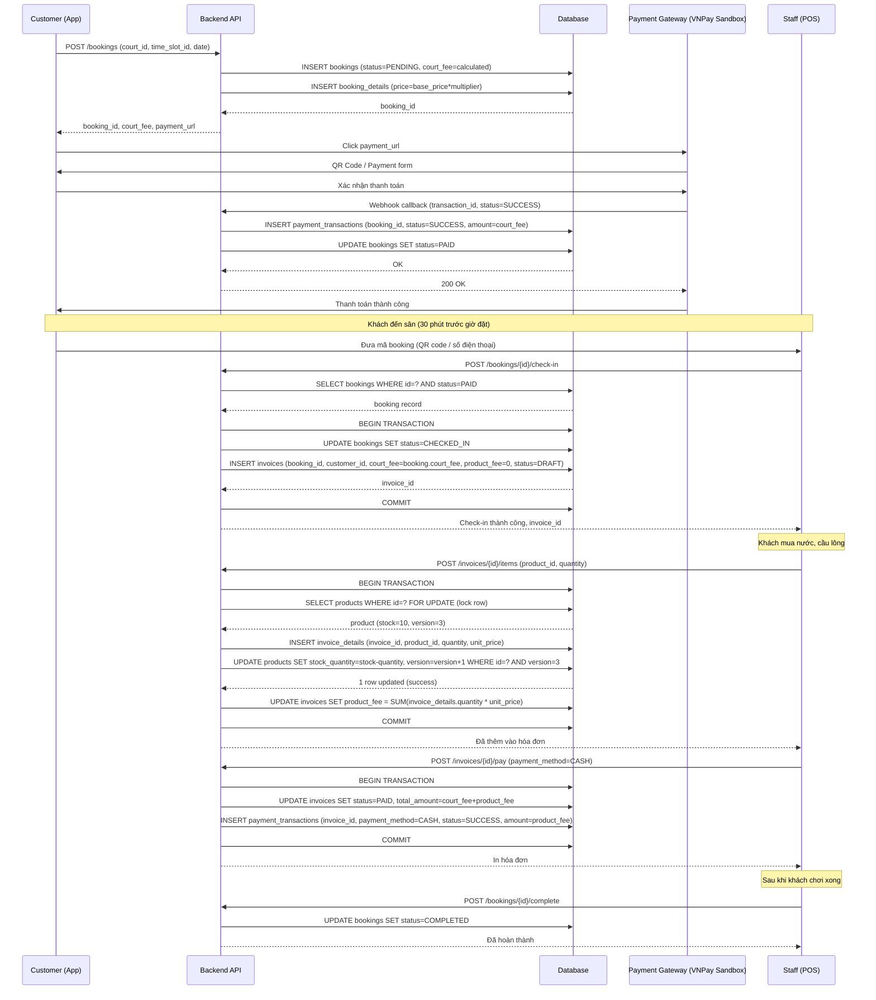
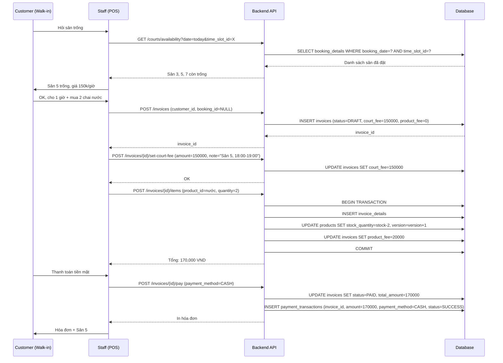
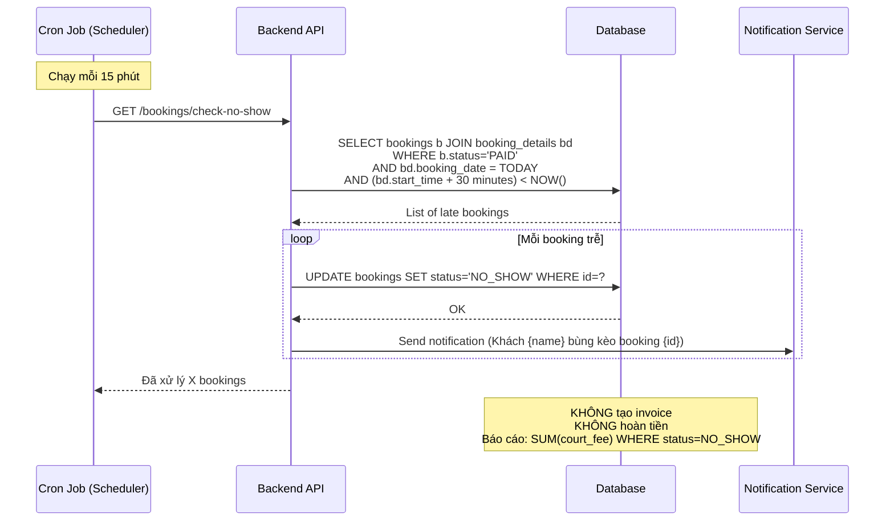

# Payment & Invoice Flow - Hệ thống Quản lý Sân Cầu Lông

## 1. Tổng Quan Luồng Nghiệp Vụ

### 1.1. Các Luồng Chính

```
┌─────────────────────────────────────────────────────────┐
│  LUỒNG 1: Đặt sân Online → Check-in → Mua thêm hàng    │
└─────────────────────────────────────────────────────────┘
Customer App:
  1. Chọn sân, khung giờ → Tạo booking (status: PENDING)
  2. Thanh toán online (VNPay Sandbox) → booking.status = PAID
  3. Đến sân check-in → booking.status = CHECKED_IN
                      → Tạo invoice (court_fee từ booking)
  4. Mua nước/cầu → Thêm invoice_details → Tính product_fee
  5. Thanh toán product_fee (cash/transfer)
  6. Chơi xong → booking.status = COMPLETED


┌─────────────────────────────────────────────────────────┐
│  LUỒNG 2: Khách vãng lai (Walk-in) - Không đặt trước   │
└─────────────────────────────────────────────────────────┘
Quầy Thu Ngân:
  1. Khách đến → Kiểm tra sân trống
  2. Tạo invoice (booking_id = NULL, court_fee = manual input)
  3. Khách mua hàng → Thêm invoice_details
  4. Tính total = court_fee + product_fee
  5. Thanh toán ngay (cash/bank_transfer) → invoice.status = PAID


┌─────────────────────────────────────────────────────────┐
│  LUỒNG 3: Đặt sân Online nhưng bùng kèo (NO_SHOW)      │
└─────────────────────────────────────────────────────────┘
Hệ Thống Tự Động:
  1. Booking đã PAID nhưng không check-in
  2. Sau khi quá giờ đặt 30 phút → Cron job đổi status = NO_SHOW
  3. KHÔNG tạo invoice (vì khách không đến)
  4. KHÔNG hoàn tiền (business rule)
  5. Báo cáo: Tổng thiệt hại từ NO_SHOW = SUM(bookings.court_fee WHERE status = NO_SHOW)
```

---

## 2. Sequence Diagrams

### 2.1. Luồng 1 - Đặt Sân Online & Check-in



---

### 2.2. Luồng 2 - Khách Vãng Lai (Walk-in)



---

### 2.3. Luồng 3 - Bùng Kèo (NO_SHOW)



---

## 3. Làm Rõ Câu Hỏi

### ❓ Invoice được tạo khi nào?
**Trả lời:**
- **Luồng Online:** Tạo lúc **CHECKED_IN** (khách đã đến sân)
- **Luồng Walk-in:** Tạo ngay khi **Staff nhập liệu** (khách đang ở quầy)
- **Luồng NO_SHOW:** **KHÔNG tạo invoice** (khách không đến)

### ❓ `invoices.court_fee` vs `bookings.court_fee` - Có duplicate?
**Trả lời:**
- **bookings.court_fee:** Tiền sân **đã thu trước** qua VNPay Sandbox (dùng cho payment gateway + báo cáo thiệt hại NO_SHOW)
- **invoices.court_fee:** Tiền sân **ghi vào hóa đơn tổng hợp** (dùng cho kế toán, in bill)

**Quan hệ:**
```
- Nếu có booking: invoices.court_fee = bookings.court_fee (copy value)
- Nếu walk-in: invoices.court_fee = staff nhập tay, bookings.court_fee = NULL (vì không có booking)
```

### ❓ Một `payment_transaction` có thể có CẢ `booking_id` VÀ `invoice_id`?
**Trả lời:** **KHÔNG**. Một transaction chỉ thuộc 1 trong 2:

**Case 1: Thanh toán tiền sân Online (trước khi check-in)**
```sql
INSERT INTO payment_transactions (
    booking_id = 'uuid-booking',
    invoice_id = NULL,  -- Chưa có invoice
    amount = 200000,
    payment_method = 'VNPAY',
    status = 'SUCCESS'
)
```

**Case 2: Thanh toán tiền hàng tại quầy (sau khi check-in)**
```sql
INSERT INTO payment_transactions (
    booking_id = NULL,
    invoice_id = 'uuid-invoice',
    amount = 50000,  -- Chỉ product_fee
    payment_method = 'CASH',
    status = 'SUCCESS'
)
```

**Constraint cần thêm:**
```sql
ALTER TABLE payment_transactions
ADD CONSTRAINT chk_payment_target 
CHECK (
    (booking_id IS NOT NULL AND invoice_id IS NULL) OR
    (booking_id IS NULL AND invoice_id IS NOT NULL)
);
```

### ❓ `customers.email` vs `users.email` - Tại sao 2 email?
**Trả lời:** **BỎ `customers.email`**. Chỉ giữ `users.email`.

**Lý do:**
- Khách hàng đăng ký tài khoản bằng email → Dùng `users.email` cho login
- Không có lý do business nào cần email thứ 2
- Nếu cần contact info khác → Dùng `customers.phone` (đã có sẵn)

**Migration:**
```sql
-- Bỏ cột customers.email
ALTER TABLE customers DROP COLUMN email;

-- Nếu cần email cho contact → JOIN với users.email
SELECT c.full_name, u.email, c.phone
FROM customers c
JOIN users u ON c.user_id = u.id;
```

---

## 4. Schema Updates

### 4.1. Bỏ CANCELLED và Loyalty Points

```sql
-- Update bookings.status enum
-- CHỈ GIỮ: PENDING, PAID, CHECKED_IN, COMPLETED, NO_SHOW

-- Bỏ cột loyalty_points
ALTER TABLE customers DROP COLUMN loyalty_points;

-- Bỏ cột email (dùng users.email)
ALTER TABLE customers DROP COLUMN email;
```

### 4.2. Thêm Constraints

```sql
-- Payment transaction phải có đúng 1 target
ALTER TABLE payment_transactions
ADD CONSTRAINT chk_payment_target 
CHECK (
    (booking_id IS NOT NULL AND invoice_id IS NULL) OR
    (booking_id IS NULL AND invoice_id IS NOT NULL)
);

-- Court fee không âm
ALTER TABLE bookings
ADD CONSTRAINT chk_bookings_court_fee_positive
CHECK (court_fee >= 0);

ALTER TABLE invoices
ADD CONSTRAINT chk_invoices_amounts_positive
CHECK (court_fee >= 0 AND product_fee >= 0 AND total_amount >= 0);

-- Stock không âm
ALTER TABLE products
ADD CONSTRAINT chk_products_stock_positive
CHECK (stock_quantity >= 0);

-- Time slot hợp lệ
ALTER TABLE time_slots
ADD CONSTRAINT chk_time_slots_valid
CHECK (start_time < end_time);
```

### 4.3. Thêm Indexes

```sql
-- Booking lookups
CREATE INDEX idx_bookings_customer_status ON bookings(customer_id, status, created_at DESC);
CREATE INDEX idx_bookings_status_date ON bookings(status) 
    WHERE status IN ('PAID', 'CHECKED_IN');

-- Check availability
CREATE INDEX idx_booking_details_availability 
    ON booking_details(booking_date, time_slot_id, court_id);

-- Invoice lookups  
CREATE INDEX idx_invoices_booking ON invoices(booking_id) 
    WHERE booking_id IS NOT NULL;
CREATE INDEX idx_invoices_customer ON invoices(customer_id, created_at DESC);

-- Payment transactions
CREATE INDEX idx_payment_trans_booking ON payment_transactions(booking_id) 
    WHERE booking_id IS NOT NULL;
CREATE INDEX idx_payment_trans_invoice ON payment_transactions(invoice_id) 
    WHERE invoice_id IS NOT NULL;

-- Products stock check
CREATE INDEX idx_products_category_active 
    ON products(category_id, stock_quantity) 
    WHERE deleted_at IS NULL;
```

---

## 5. State Machine - Booking Status

```
┌─────────┐
│ PENDING │ Khách vừa tạo booking, chưa thanh toán
└────┬────┘
     │ Thanh toán VNPay Sandbox thành công
     ▼
┌─────────┐
│  PAID   │ Đã thanh toán, chờ đến sân
└────┬────┘
     │ Check-in tại quầy → Tạo invoice
     ▼
┌────────────┐
│ CHECKED_IN │ Đã check-in, đang chơi
└─────┬──────┘
      │ Staff đánh dấu hoàn thành
      ▼
┌───────────┐
│ COMPLETED │ Đã chơi xong
└───────────┘

┌─────────┐
│  PAID   │
└────┬────┘
     │ Quá giờ 30 phút, không check-in
     │ (Cron job tự động)
     ▼
┌─────────┐
│ NO_SHOW │ Bùng kèo - KHÔNG hoàn tiền
└─────────┘
```

**Transitions:**
- `PENDING → PAID`: Webhook từ payment gateway
- `PAID → CHECKED_IN`: Staff scan QR/nhập số điện thoại
- `CHECKED_IN → COMPLETED`: Staff click "Hoàn thành"
- `PAID → NO_SHOW`: Cron job (sau 30 phút quá giờ)

**Không cho phép:**
- ❌ PAID → PENDING (không thể "undo" thanh toán)
- ❌ CHECKED_IN → PAID (không quay lại)
- ❌ Bất kỳ status nào → CANCELLED (đã bỏ)

---

## 6. Báo Cáo Tài Chính

### 6.1. Doanh Thu Tiền Sân
```sql
-- Doanh thu thực tế (đã check-in)
SELECT SUM(court_fee) 
FROM bookings 
WHERE status IN ('CHECKED_IN', 'COMPLETED')
AND DATE(created_at) = '2024-01-15';

-- Thiệt hại từ NO_SHOW
SELECT SUM(court_fee)
FROM bookings
WHERE status = 'NO_SHOW'
AND DATE(created_at) = '2024-01-15';
```

### 6.2. Doanh Thu Hàng Hóa
```sql
SELECT SUM(product_fee)
FROM invoices
WHERE status = 'PAID'
AND DATE(created_at) = '2024-01-15';
```

### 6.3. Tổng Doanh Thu
```sql
SELECT SUM(total_amount)
FROM invoices
WHERE status = 'PAID'
AND DATE(created_at) = '2024-01-15';
```

---

Xong! Còn câu hỏi nào chưa rõ không?
