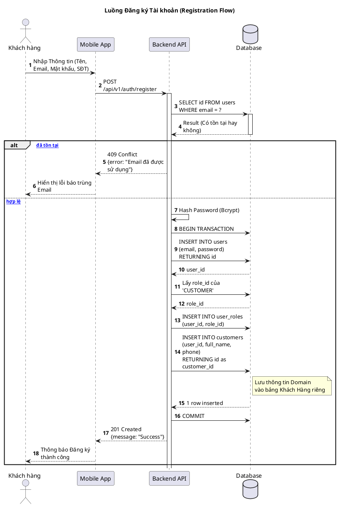
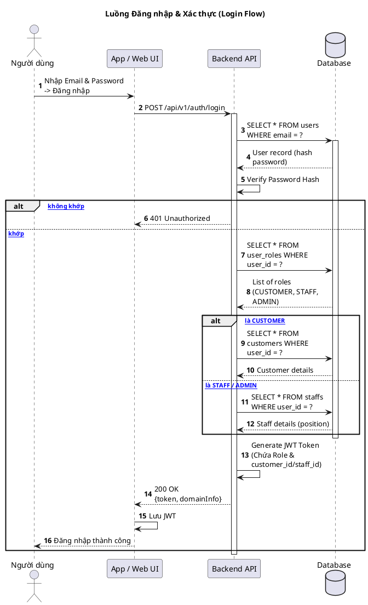
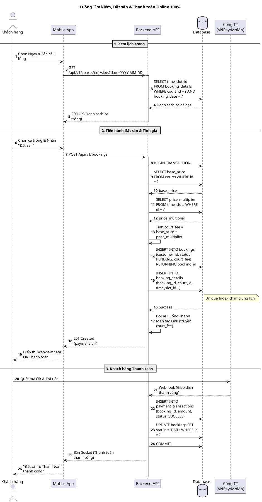
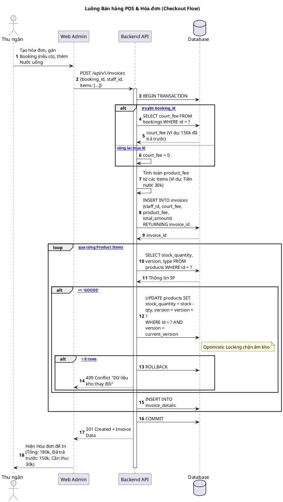
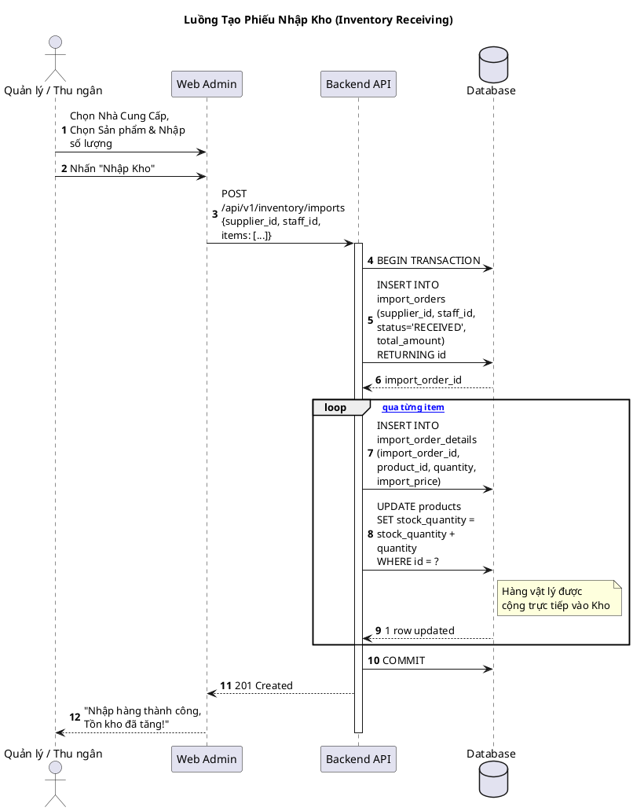

# Sơ đồ Sequence (Tuần tự) - Hệ thống Đặt Sân Cầu Lông (Bản Cập Nhật V4)

Sơ đồ Sequence này đã được thiết kế lại hoàn toàn để bám sát với cấu trúc Database V4 mới nhất (Bao gồm: Tách Khách hàng/Nhân viên, Hệ số giờ, Thanh toán 100% Online, Tách bạch tiền POS và Bổ sung luồng Nhập Kho).

## Hướng dẫn xem hình
Copy từng đoạn code bên dưới và dán vào **[PlantText](https://www.planttext.com/)** để render thành ảnh.

---

## 1. Luồng Đăng ký Tài khoản Khách hàng (Registration Flow)

---

## 2. Luồng Đăng nhập & Xác thực (Login Flow)

---

## 3. Luồng Tìm kiếm, Đặt sân & Thanh toán Online (Booking Flow 100% Upfront)

---

## 4. Luồng Bán hàng POS & Xuất Hóa đơn (Checkout Flow)

---

## 5. Luồng Quản lý Nhập Kho (Inventory Receiving Flow - MỚI)

