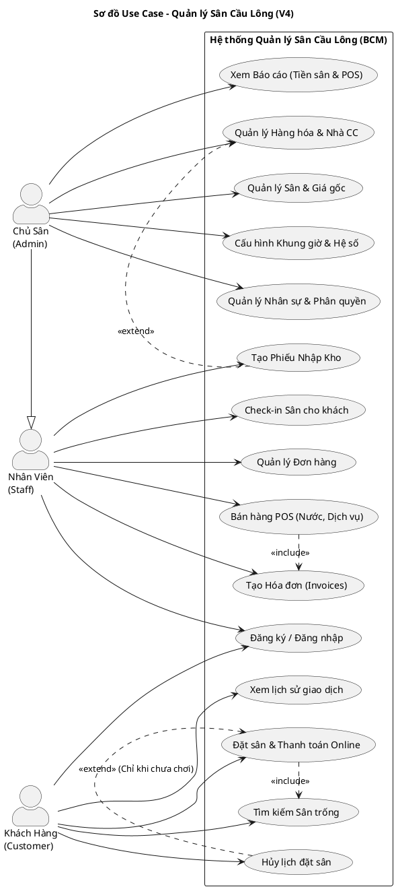

# Sơ đồ Use Case - Hệ thống Quản lý Sân Cầu Lông (Bản Cập Nhật V4)

Sơ đồ này đã phân chia rõ 3 nhóm người dùng (Actors) theo đúng thiết kế CSDL mới: Khách Hàng (Customers), Nhân Viên (Staffs) và Chủ Sân (Admins).

## Mã nguồn PlantUML

