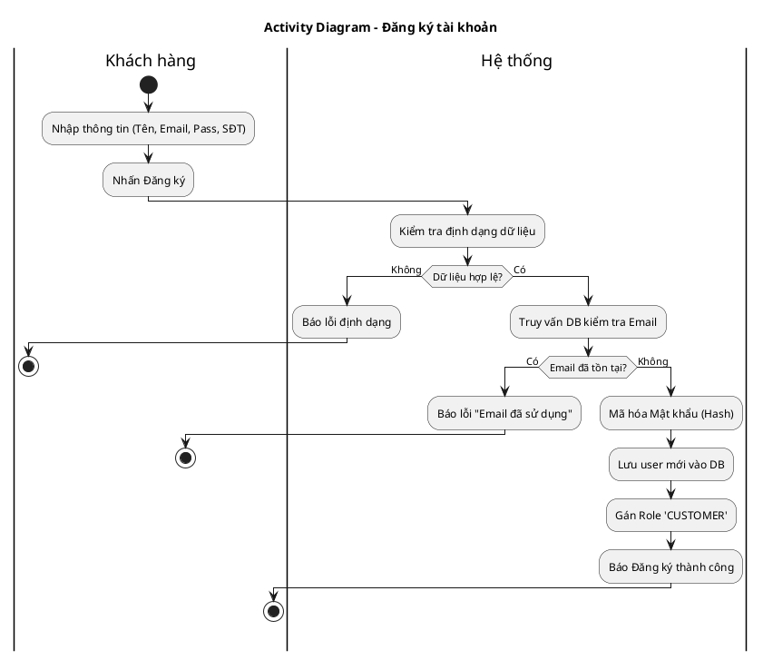
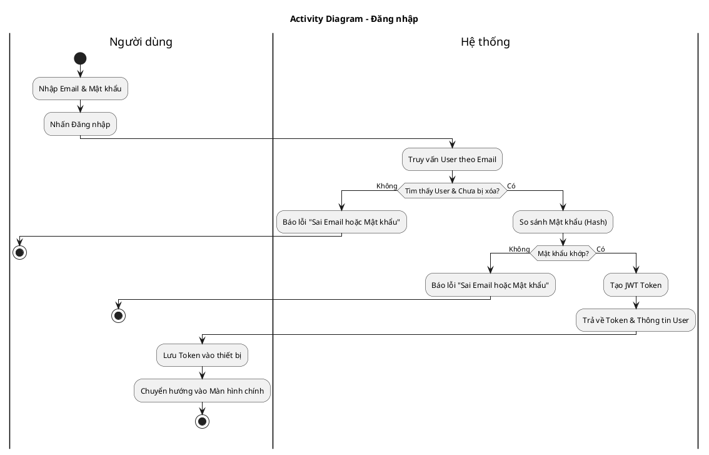
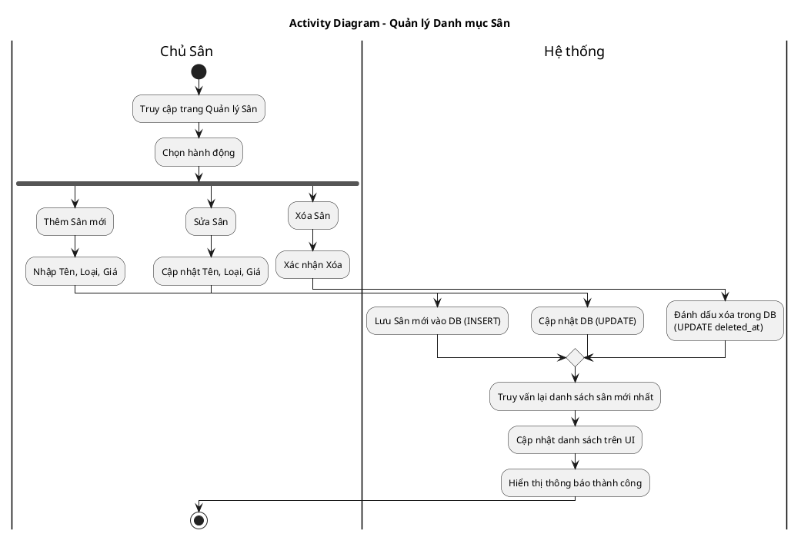
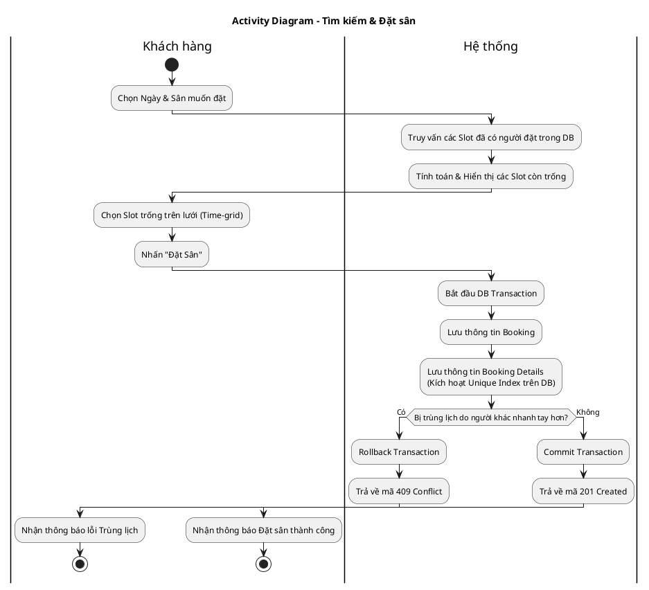
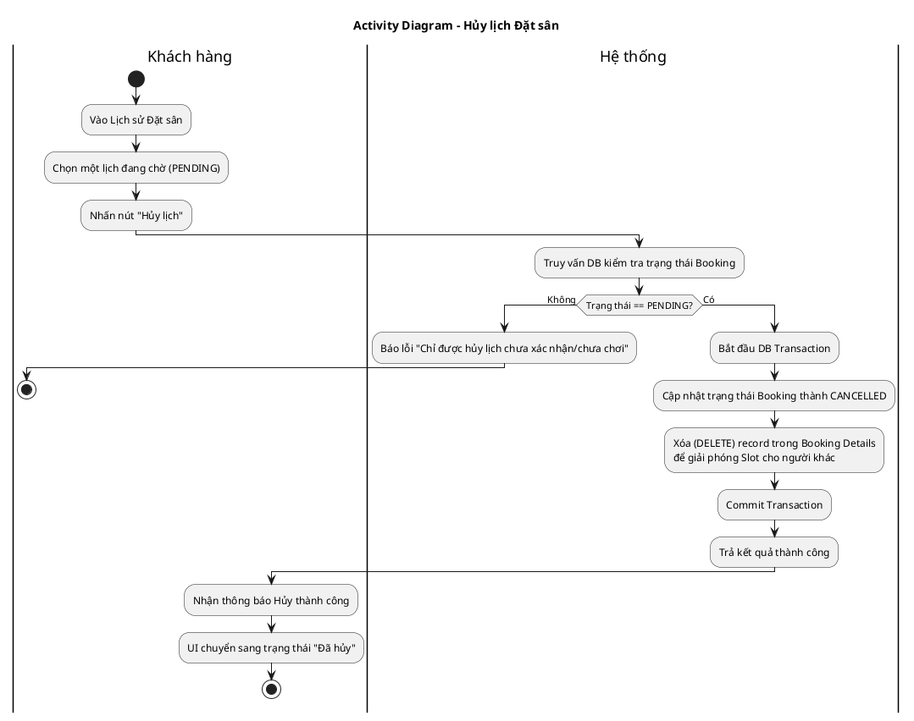
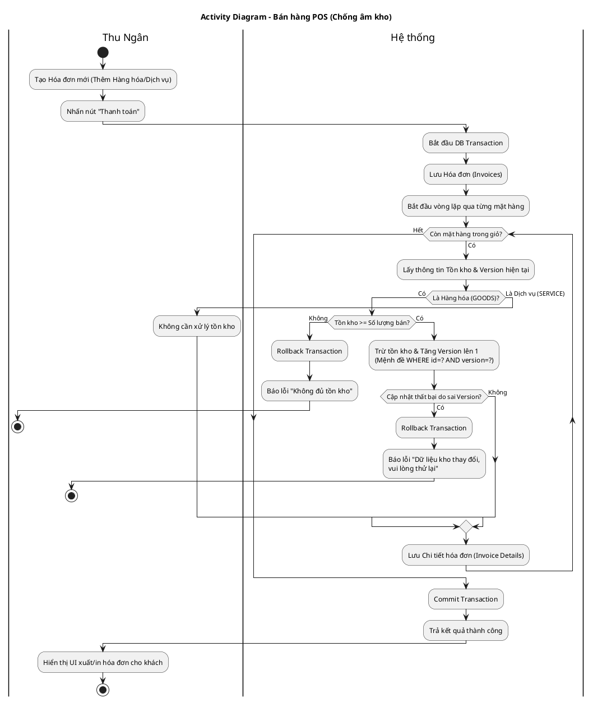
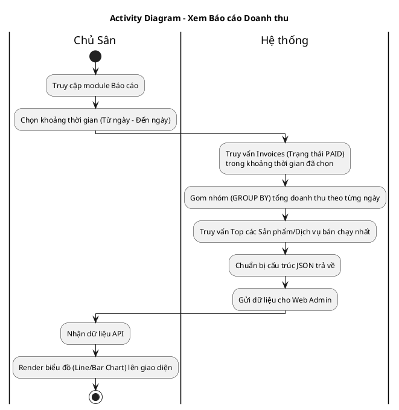

# Sơ đồ Activity (Hoạt động) - Hệ thống Đặt Sân Cầu Lông

Tài liệu này chứa mã nguồn PlantUML để vẽ 7 luồng Hoạt động (Activity Diagrams) tương ứng với 7 luồng Sequence Diagram. Sơ đồ Activity giúp mô tả rõ ràng luồng chạy của thuật toán, các rẽ nhánh (if/else), vòng lặp và điểm kết thúc của từng chức năng.

## Hướng dẫn xem hình
Copy từng đoạn code bên dưới và dán vào **[PlantText](https://www.planttext.com/)** để render thành ảnh.

---

## 1. Luồng Đăng ký Tài khoản

---

## 2. Luồng Đăng nhập & Xác thực

---

## 3. Luồng Quản lý Danh mục Sân

---

## 4. Luồng Tìm kiếm & Đặt sân

---

## 5. Luồng Hủy lịch Đặt Sân

---

## 6. Luồng Bán hàng POS & Tồn kho

---

## 7. Luồng Báo cáo Doanh thu

