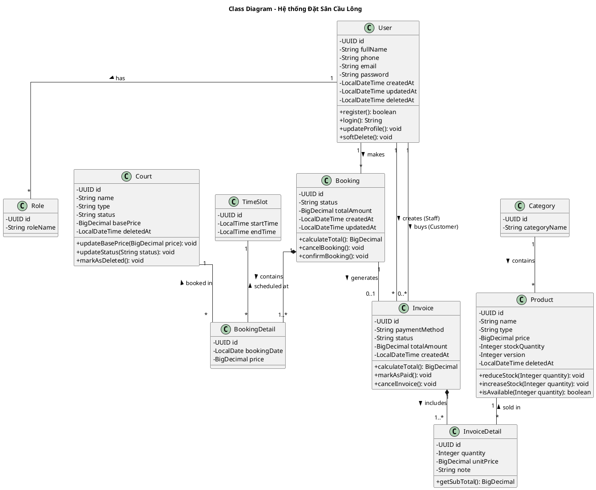

# Sơ đồ Class (Lớp) - Hệ thống Đặt Sân Cầu Lông

Tài liệu này chứa mã nguồn PlantUML mô phỏng cấu trúc Lớp (Class Diagram). Sơ đồ này cực kỳ hữu ích khi bạn bắt đầu code Backend (Spring Boot JPA Entities) hoặc Frontend (Models/Interfaces trong React/TypeScript). 

Nó mô tả các thuộc tính (Attributes), kiểu dữ liệu (Data Types), phương thức (Methods) và các mối quan hệ (Associations, Aggregations, Compositions) giữa các thực thể.

## Hướng dẫn xem hình
Copy đoạn code bên dưới và dán vào **[PlantText](https://www.planttext.com/)** để render thành ảnh.

---

## Mã nguồn PlantUML

