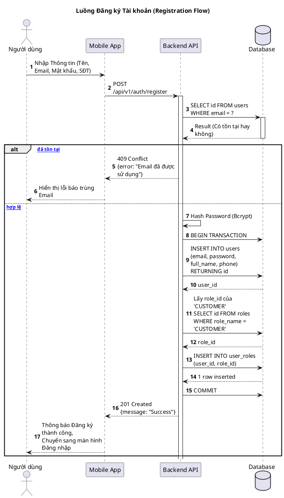
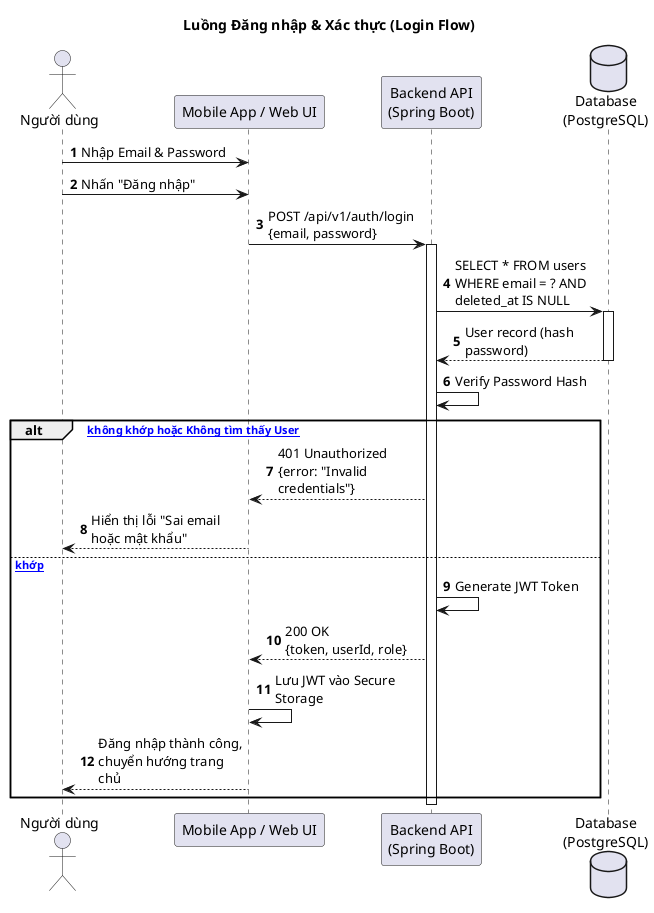
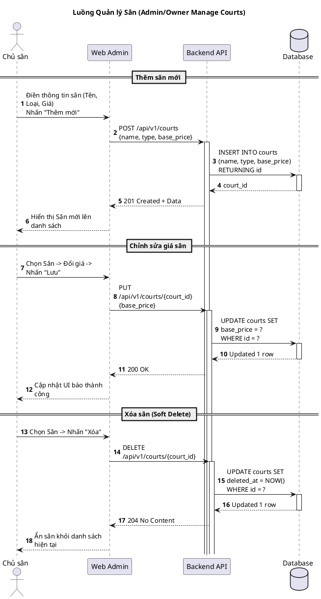
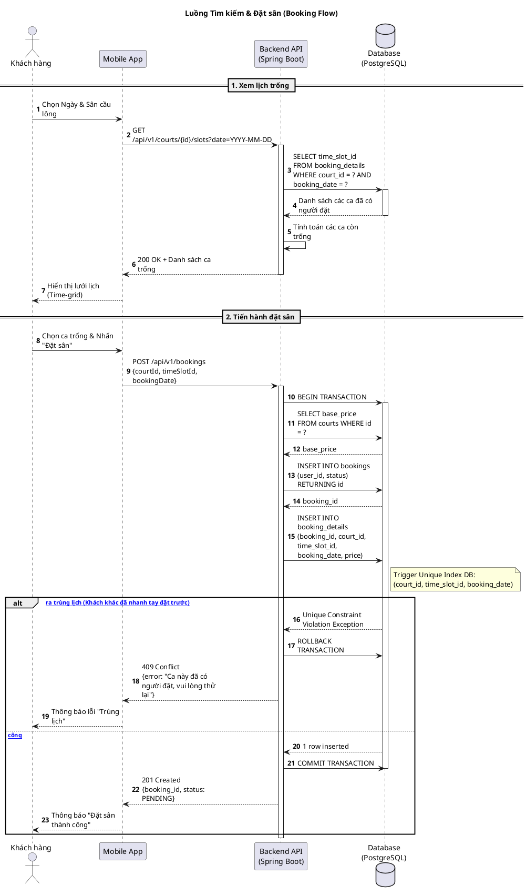
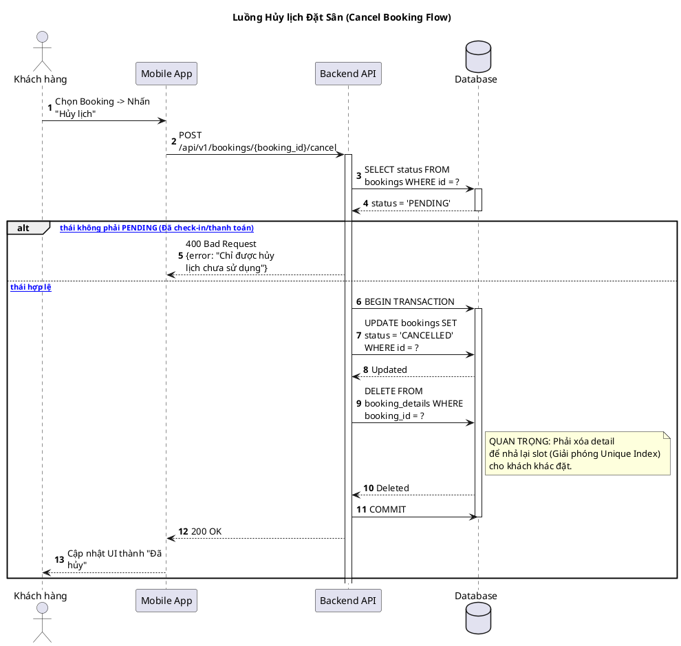
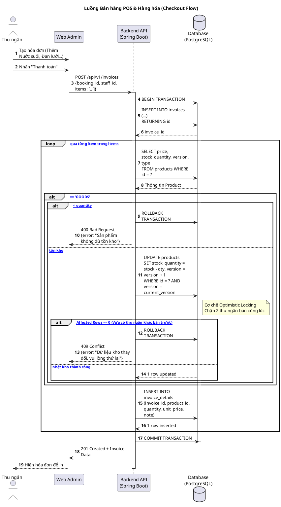
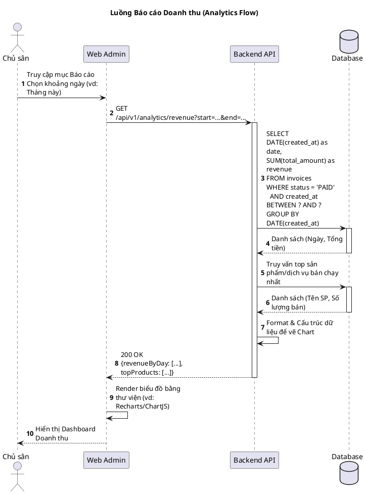

# Sơ đồ Sequence (Tuần tự) - Hệ thống Đặt Sân Cầu Lông (Bản Đầy Đủ)

Dựa trên yêu cầu của bạn, mình đã mở rộng sơ đồ Sequence để bao phủ toàn bộ vòng đời của hệ thống. Dưới đây là **7 luồng nghiệp vụ cốt lõi**, trải dài từ lúc Khách hàng đăng ký cho đến khi Chủ sân xem báo cáo cuối tháng.

## Hướng dẫn xem hình
Copy từng đoạn code bên dưới và dán vào **[PlantText](https://www.planttext.com/)** để render thành ảnh.

---

## 1. Luồng Đăng ký Tài khoản (Registration Flow)

---

## 2. Luồng Đăng nhập & Xác thực (Login Flow)

---

## 3. Luồng Quản lý Danh mục Sân (Manage Courts Flow - Chủ sân)

---

## 4. Luồng Tìm kiếm & Đặt sân (Booking Flow - Chống trùng lịch)

---

## 5. Luồng Hủy lịch Đặt Sân (Cancel Booking Flow)

Giới thiệu kĩ thuật xóa Detail để giải phóng Slot cho người khác đặt.

---

## 6. Luồng Bán hàng & Dịch vụ POS (Checkout & Optimistic Locking)

---

## 7. Luồng Báo cáo Doanh thu (Analytics Flow)

