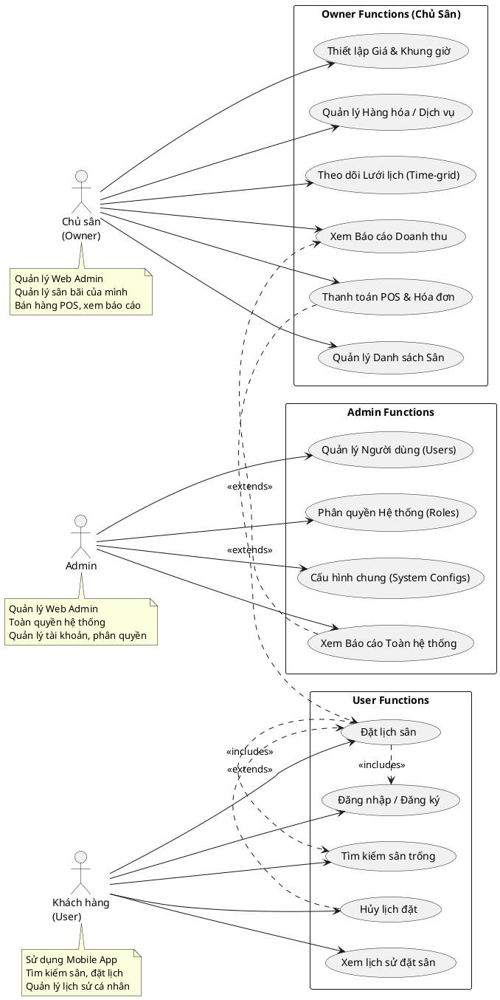

# Sơ đồ Use Case - Hệ thống Đặt Sân Cầu Lông

Dựa trên yêu cầu và hình mẫu của bạn, mình đã thiết kế sơ đồ Use Case bằng ngôn ngữ **PlantUML**. Sơ đồ phân tách rõ 3 Actor (Người dùng) và nhóm các chức năng (Functions) vào từng block (rectangle) giống hệt hình bạn gửi.

## Hướng dẫn xem hình
Vì PlantUML là dạng code sinh ra hình ảnh, bạn hãy copy toàn bộ đoạn code trong khung bên dưới và dán vào 1 trong các trang web sau để xem và tải ảnh PNG về nhé:
1. **[PlantText](https://www.planttext.com/)** (Khuyên dùng - giao diện đẹp)
2. **[PlantUML Web Server](http://www.plantuml.com/plantuml/uml/)**

---

## Mã nguồn PlantUML (Copy đoạn này)

